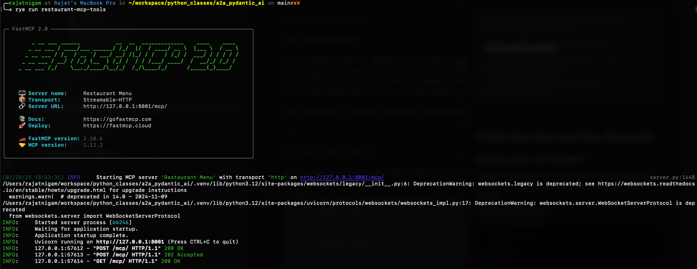
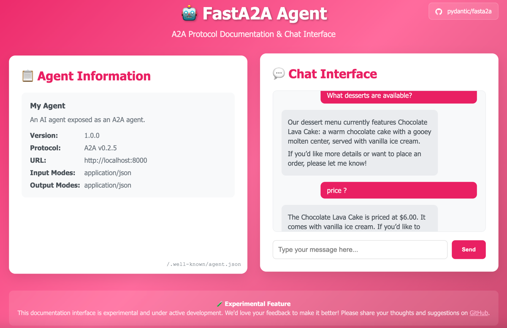
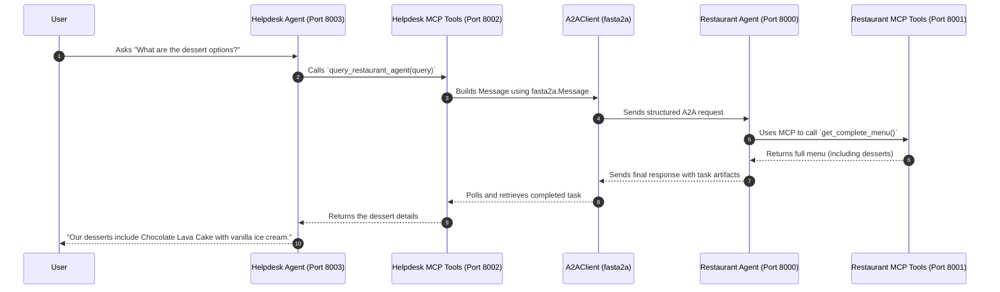

# Building a Composable A2A Helpdesk Assistant Using Pydantic-AI and FastMCP

In the rapidly evolving world of AI agents, building systems that can **collaborate** rather than act in isolation is key. Agent-to-Agent (A2A) communication enables modular, specialized agents to work together seamlessly. This post walks you through creating a composable **Hotel Helpdesk Assistant** that communicates with a **Restaurant Agent** using `pydantic-ai`, `fastmcp2`, and `fasta2a`.

We’ll explore how these tools work together to enable an LLM-driven helpdesk to delegate restaurant-related queries to a separate, specialized agent—without breaking the user experience.

GitHub repo: [github.com/commitbyrajat/a2a-pydantic-ai](https://github.com/commitbyrajat/a2a-pydantic-ai)

---

## What We’re Building

This system includes:

* A **Helpdesk Agent**: Handles hotel-related tasks like check-ins, room services, and local information.
* A **Restaurant Agent**: Specialized in food-related queries and menu lookups.
* An **MCP tool layer**: Defines and exposes reusable tools (functions) via HTTP.
* An **A2A communication layer**: Allows agents to delegate tasks to each other.

Each component is loosely coupled and communicates over HTTP using structured message schemas.

---

## Project Bootstrapping

You’ll need Python 3.8+ and [Rye](https://rye.astral.sh/) for managing dependencies. Once cloned, follow these steps to bring the system up:

```bash
# Step 1: Start the restaurant MCP tool server
rye run restaurant-mcp-tools

# Step 2: Start the restaurant A2A agent
rye run restaurant-agent

# Step 3: Start the helpdesk MCP tool server
rye run helpdesk-mcp-tools

# Step 4: Start the helpdesk A2A agent
rye run helpdesk-agent
```

---

## Code Overview and Key Concepts

### Defining Tools with FastMCP

FastMCP enables agents to register tools using simple decorators. These tools can later be exposed to any agent using the MCP protocol.

**`restaurant_tools.py`**:

```python
from fastmcp import FastMCP

mcp = FastMCP(name="Restaurant Menu")

restaurant_menu = {
    "Margherita Pizza": {"price": 8.99, "description": "Classic pizza..."},
    ...
}

@mcp.tool
def get_item_details(name: str):
    return restaurant_menu[name]

@mcp.tool
def get_complete_menu():
    return restaurant_menu
```

Each `@mcp.tool` function becomes discoverable and callable through a FastAPI server, and agents can integrate them dynamically via HTTP.

---

### Serving Tools with FastMCP2

To expose these tools, we run the following:

```bash
rye run restaurant-mcp-tools
```

This uses FastMCP's built-in CLI:

```toml
[tool.rye.scripts]
restaurant-mcp-tools = "fastmcp run src/a2a_pydantic_ai/mcp/restaurant_tools.py -t http -p 8001"
```



This runs a FastAPI app on port 8001, serving the registered tools under the `/mcp/` path.

---

### Integrating MCP Tools in an Agent

The Restaurant Agent consumes these tools by loading them using `MCPServerStreamableHTTP`.

**`restaurant_agent.py`**:

```python
from pydantic_ai import Agent
from pydantic_ai.mcp import MCPServerStreamableHTTP

restaurant_mcp_server = MCPServerStreamableHTTP("http://127.0.0.1:8001/mcp/")

agent = Agent(
    "openai:gpt-4.1",
    instructions="Answer guest questions about dishes or share the full menu.",
    toolsets=[restaurant_mcp_server],
)
app = agent.to_a2a()
```

This tells the agent:

* What its role is (a food menu assistant).
* Which tools it has access to (those defined in the MCP server).
* How it should respond to incoming A2A messages.

---

### The Helpdesk Delegates via A2A

Here’s where the system gets interesting. The Helpdesk Agent doesn’t need to know about food or menus. Instead, it **delegates** those queries to the Restaurant Agent using `fasta2a`.

**`helpdesk_tools.py`**:

```python
from fasta2a.client import A2AClient, Message
from fasta2a.schema import TextPart

RESTAURANT_AGENT = "http://localhost:8000"

@mcp.tool
async def query_restaurant_agent(query: str):
    client = A2AClient(base_url=RESTAURANT_AGENT)
    user_msg = Message(
        role="user",
        parts=[TextPart(kind="text", text=query)],
        kind="message",
        message_id=str(uuid.uuid4()),
    )

    response = await client.send_message(message=user_msg)
    task_id = response["result"]["id"]

    while response["result"]["status"]["state"] not in ["completed", "failed"]:
        await asyncio.sleep(2)
        response = await client.get_task(task_id)

    return response["result"]["artifacts"][-1]["parts"][-1]["text"]
```

### Understanding `A2AClient` and `Message`

* `A2AClient` is a robust HTTP client that allows one agent to send structured messages to another.
* `Message` is the schema that wraps the user’s query.
* The system polls the Restaurant Agent until the task completes and then extracts the final output.

This tool becomes part of the Helpdesk Agent’s toolset via FastMCP.

---

### Helpdesk Agent with Delegation

**`helpdesk_agent.py`**:

```python
from pydantic_ai import Agent
from pydantic_ai.mcp import MCPServerStreamableHTTP

helpdesk_mcp_server = MCPServerStreamableHTTP("http://localhost:8002/mcp/")

agent = Agent(
    "openai:gpt-4.1",
    instructions="You are a helpful hotel helpdesk assistant. Assist with bookings, check-in, and food queries by calling restaurant services.",
    toolsets=[helpdesk_mcp_server],
)
app = agent.to_a2a()
```

Now, when a user asks:
**“What desserts are available?”**
The Helpdesk Agent uses the `query_restaurant_agent` tool to fetch that information from the Restaurant Agent.



---

## A2A Communication Diagram

Here’s how the components interact when a user makes a restaurant-related query:



---

## What is `fasta2a`?

`fasta2a` is a structured protocol and client/server library for agent-to-agent communication over HTTP. It enables agents to:

* Send and receive structured messages.
* Track task state (running, completed, failed).
* Return multi-part artifacts (text, image, etc.).

It ensures that agents can treat other agents as intelligent, modular services, enabling scalable orchestration.

---

## What is `fastmcp2`?

`fastmcp2` is a modern implementation of the Model Context Protocol (MCP), a design pattern that standardizes how AI models (especially LLM agents) interact with callable, structured tools. It provides a robust framework for building, serving, and composing LLM-friendly tools that are:

* **Typed**: Each tool has clear input and output types using Python’s type hints.

* **Documented**: Tools are self-describing, making them easy for agents to discover and understand.

* **Reusable**: Once defined, tools can be reused by any agent that supports the MCP interface.

---

## Final Thoughts

This system demonstrates the power of **multi-agent architectures**. By combining `fastmcp`, `pydantic-ai`, and `fasta2a`, we’ve built a fully functioning hotel helpdesk that:

* Delegates food-related tasks to a restaurant expert agent.
* Uses type-safe tools exposed over HTTP.
* Maintains clarity and modularity throughout the codebase.

This pattern scales. Tomorrow you could plug in a billing agent, a concierge bot, or a travel assistant. Each would be self-contained, reusable, and accessible via A2A.

Explore the full code here:
[github.com/commitbyrajat/a2a-pydantic-ai](https://github.com/commitbyrajat/a2a-pydantic-ai)

---
